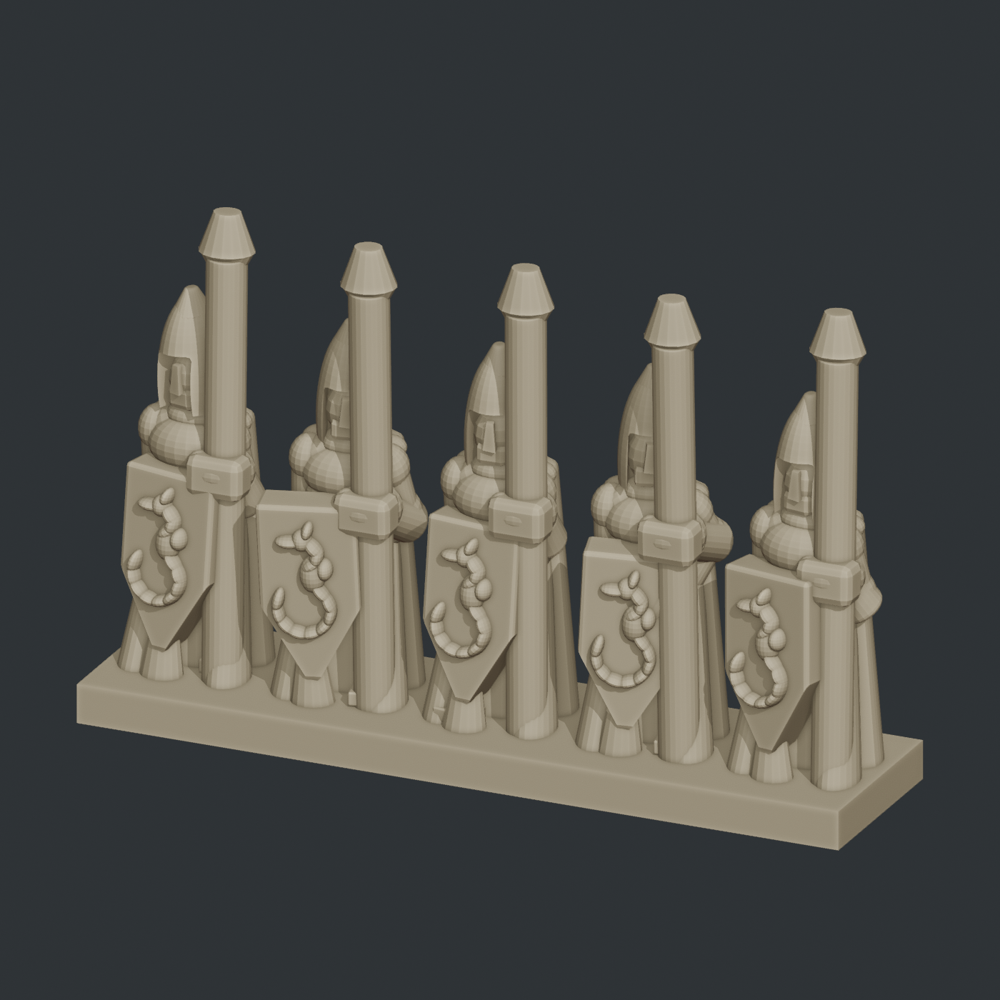

# Epic High Berts

The accepted target is five high-elf spearmen, **10.4 mm sole-to-eye**, with
**1.56 mm intact spear shafts** on a **26 × 6.5 × 1.3 mm strip**. The user printed
the 130% enlargement and accepted the improved result. The
[pinned print target](specs/elf-print-target.json) and
[trial record](docs/intact-spears-130-trial.md) identify the exact source and scale.
The separate-spear/open-grip experiment is retired.

Reusable source recipes remain at 8 mm sole-to-eye; the accepted print applies
1.3 scale once to the complete intact row. Python recipes generate an orbitable Blender scene and
trial-print files for a five-tool Prusa XL using tool 2's 0.25 mm nozzle.



Revision 11 adds a backed mail breast panel, short tunic sleeves with hems,
and a raised leaf crest on each helmet. It preserves revision 10's crown and
face recipes. Generate it with `specs/elf-spearman-proof-v11.json`; the images
and published evidence below still document revision 10.

Revision 10 has five individual poses, broad pointed shields with raised
seahorse insignia, shoulder-hung flared capes, rounded torso and shoulder armor,
continuous spear grips, and curved pointed helmets with integrated brows and
cheek guards. Fuller heads fill the space beneath the approved helmet brow,
with carved eyes and mouth lines and the shared long planar nose.
Earlier recipes remain pinned for reproducibility.

Historical revision 10 status: **visual proof; printability screen failed**. Geometry and
head-fill checks pass, but sliced nose detail and unsupported paths require
refinement. The conservative automatic-support estimate fell from 36.2% to
31.3% of model filament, excluding the brim. That historical build had no physical
trial. The current 130% target has user-reported physical acceptance, but has not
passed the complete formal gates and is not labeled **digitally validated**.

## Run a visual review

See [army design requirements](docs/design-requirements.md) for the printer,
geometry targets, reusable-part rules and the distinction between visual
review and print validation.

The default workflow is now [reusable parts and cached assembly](docs/reusable-parts.md):

```powershell
py -3.13 -m fdm_sculpt.atelier part aurelian.crest@2 --seed 1001 --output out/crest-review
py -3.13 -m fdm_sculpt.atelier compose specs/elf-modular-visual.json --seed 1001 --output out/army-review
```

Open the browser viewer at **http://127.0.0.1:8765**. First install its local
dependency and start the server (no JavaScript build step):

```powershell
npm --prefix viewer ci
py -3.13 -m fdm_sculpt.viewer serve
```

The viewer opens on an **individual model**. Select Spearmen, Swordsmen, Archers or
Bertmasters and a variant, then orbit or isolate a component for review.
**Sculpting feedback** saves your note, model revision, selected component and
camera angle under `out/sculpt-feedback/`. Saved unit, cavalry and part reviews
remain available in **Saved unit / part reviews**.

Short-sword infantry have their own Swordsmen unit type. Spearmen retain a
sword-armed sergeant, which counts toward the row's command-model limit.

**Build a row** still works in source dimensions: it places five chosen infantry on a 20 × 5 × 1 mm
base with 0.5 mm terrain relief and 4 mm spacing. **Magnet holes** is off by
default. Enabling it uses a 2 mm base with two underside pockets for 3 × 1 mm
magnets (3.2 mm diameter, 1.1 mm deep), raising the terrain and figures together.
Use the pinned print target for the accepted intact-spear row; an arbitrary row
builder export is not that tested target. Do not enlarge an already scaled STL again.
Choose each slot or use **Randomize row** with a seed
and a selectable variant pool. Defaults allow duplicates and at most one command
model. Uniqueness and command limits apply to randomization; manual slot choices
override them, including when previewing and exporting the selected row.
Preview the row, then choose **Generate STL**. Editing the row invalidates its
export preview; the server also checks that all pinned model revisions still match.

Exports run in the background while model review remains available. **STL exports**
shows progress and downloadable reports. At the user's request, the worker loads
cached parts, performs one collection-wide **Manifold Boolean Union** in Blender,
and uses Blender's native STL exporter. Sleeve CSG is evaluated on temporary
copies using Manifold too, avoiding
Exact-cache slivers that can make the row union fail. A rejected Boolean stops
the export; it must never publish only the unchanged base. Source recipes and
visual caches remain unchanged. Downloads are labeled **unchecked Blender
output**. This path does not run geometry validation, independent repeat builds,
or slicing. The saved scene, selected variants, union order and timing remain
available in each job. Historical validated-proof workflows are separate.
Jobs and their pinned selections are preserved under `out/workshop-jobs/`.
Running exports can be cancelled from their job card, retaining build evidence.
The row builder preserves model geometry; it does not automatically repair poses
or alter decoration to make a failing row pass.

Each successful `atelier compose` or `atelier part` automatically updates the
viewer. To load an existing saved review without recomputing geometry:

```powershell
py -3.13 -m fdm_sculpt.viewer publish out/army-review
```

Orbit, zoom, isolate a figure/component, or hide shields to inspect the mail.
Hold Ctrl and hover to outline the exact geometry piece in orange and see both
its name (such as a sole, shoe upper, or shin) and its component name, figure,
and revision. The remaining pieces of that component are outlined in yellow.
Both outlines remain visible through covering model geometry.
The hover label leads with a short hex ID (for example `#00A7`) that you can
type in feedback. IDs distinguish figure instances and persist across updates
to the same component slot and geometry role. Resolve one from the CLI with
`py -3.13 -m fdm_sculpt.viewer piece 00A7`. The local registry is saved in
`out/viewer/piece-ids.json`; keep it to preserve previously assigned IDs.
Alt-hover works the same way. Fused surfaces use their final geometry role;
hidden construction cutters are not selectable. Older saved exports retain
component-level identification until republished.
Use **Model / unit** to switch between saved reviews. The reusable standard
bearer is available alone (`specs/elf-standard-bearer.json`) and in the middle
of the five-elf unit (`specs/elf-unit-center-standard.json`). Both share
`specs/models/elf-standard-bearer.json`; changes to that model recipe carry
through to either layout on its next composition. See the
[model and unit workflow](docs/reusable-parts.md#reusable-models-and-unit-variants)
for mixing pieces and placing future army variants without rebuilding meshes.
Archers are available as `specs/elf-archer.json` and `specs/elf-unit-archers.json`,
sharing `specs/models/elf-archer.json`. They wear cloth tunics, stand side-on,
and aim raised bows forward. The viewer lists them as **Archer** and **Elf archers**.
**Archer sergeant** (`specs/elf-archer-sergeant.json`) carries a bow at the side
and blows the shared war horn.
**Archer variants (10)** (`specs/elf-archer-variants.json`) adds aiming, empty-bow,
quiver-reaching and shortblade poses. Use the Figure selector to isolate one.
The page checks for updates every two seconds, verifies mesh checksums, and
displays the loaded revision. Failed updates retain the previous model with an
explicit warning. Blender runs in the background for geometry only; its GUI
is optional. Controls use [Three.js OrbitControls](https://threejs.org/docs/pages/OrbitControls.html).

Only missing or changed parts compile;
unchanged pieces are shared collection instances. Renders are opt-in with
`--render`. The full recipes below remain available for historical proofs.

Use `preview` during visual iteration. It evaluates local face and decoration
cuts once, saves overlapping parts in `VISUAL_PREVIEW`, and skips the expensive
whole-strip fusion, manufacturing checks, repeat build and slicing. Hidden
recipes and saved-scene provenance remain available. These scenes are for
appearance review only. Use `build` when preparing for printing.

Use Python 3.13 and Blender **5.1.2**. Set `BLENDER_BIN` if Blender is outside the
standard installation paths. From this repository:

```powershell
py -m pip install -e ".[test]"
py -m fdm_sculpt.regiment preview specs/elf-spearman-proof-v11.json --seed 1001 --output out/elf-v11-preview
py -m pytest
```

Open `out/elf-v11-preview/internal/elf-spearman-proof.blend` and orbit the selected
figures with the middle mouse button. Three review PNGs appear in `previews/`;
add `--no-renders` for the fastest scene-only iteration.
Use a fresh output directory for every generation. Hidden `SOURCE_PRIMITIVES`
retain the parameterized geometry and Exact CSG operands; `EVALUATED_EXPORT`
is populated only by fused proof builds. Revise recipes and regenerate instead of editing
mesh vertices.

## Prepare a trial print

The print adapter currently targets Windows and the installed PrusaSlicer **2.9.6**, with
these existing installed presets:

- Printer: `Original Prusa XL - 5T 0.25 nozzle - Miniatures`
- Print: `0.05mm ULTRADETAIL @XLIS 0.25 - Balanced Miniatures`
- Filament: `Generic PLA @XL`

These locally configured presets are prerequisites; their private snapshots are
not distributed in this source repository. The adapter resolves inheritance and
writes hashed build-local snapshots without modifying the installed presets.
It preserves the nozzle array `0.4,0.25,0.4,0.4,0.4`, selects tool 2, and retains
0.05 mm layers, a 0.14 mm first layer, three perimeters, conservative speeds and
a 6 mm brim. Automatic supports, the wipe tower and binary G-code are disabled.

```powershell
py -m fdm_sculpt.regiment build specs/elf-spearman-proof-v10.json --seed 1001 --output out/elf-v10-trial
py -m fdm_sculpt.regiment assess out/elf-v10-trial --support-audit
py -m fdm_sculpt.regiment build specs/elf-spearman-proof-v10.json --seed 1001 --output out/elf-v10-repeat --no-renders --no-slice
py -m fdm_sculpt.regiment validate out/elf-v10-trial --compare out/elf-v10-repeat
```

The build emits mono STL, generic 3MF, a PrusaSlicer project 3MF and plain-text
G-code. Validation reopens artifacts, checks tool 2 (`T1`) extrusion, compares
same-seed geometry, and inspects layer coverage, islands and unsupported growth.
The `assess` command checks deposited plastic beneath each layer, named facial
details, and optionally creates a separate automatic-support diagnostic slice.
It returns a nonzero exit code when the design screen fails and preserves the
evidence. See the [printability criteria and findings](docs/printability.md).
Only a passing validation manifest earns the label **digitally validated**.
Print upright with the strip flat on the bed and PLA loaded in tool 2.

## Source and evidence

- [Construction and validation rules](docs/construction.md)
- [Printability criteria and current findings](docs/printability.md)
- [Technical proof evidence](proof/review.json)
- [Helmet and grip detail](docs/images/face-grip-detail.png)
- [Fitted face detail](docs/images/face-three-quarter.png)
- [Seahorse shield detail](docs/images/seahorse-shield.png)
- [Shoulder cape detail](docs/images/cape-shoulders.png)

The component library is Blender-free and pins every revision's definition and
resolved-plan hashes. Integration tests can reopen a generated scene by setting
`ELF_PROOF_BUILD` to its absolute build directory before running pytest.
Historical revision-specific tests skip when given a different revision.

This repository contains the elf effort and its required generic primitive,
mesh and file-format support. Generated builds and local slicer settings stay
under ignored `out/` directories. Archers and command strips follow acceptance
of the spearman proof; cavalry, multicolor and commercial packaging are outside
this milestone.
