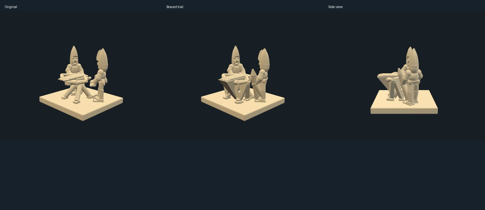
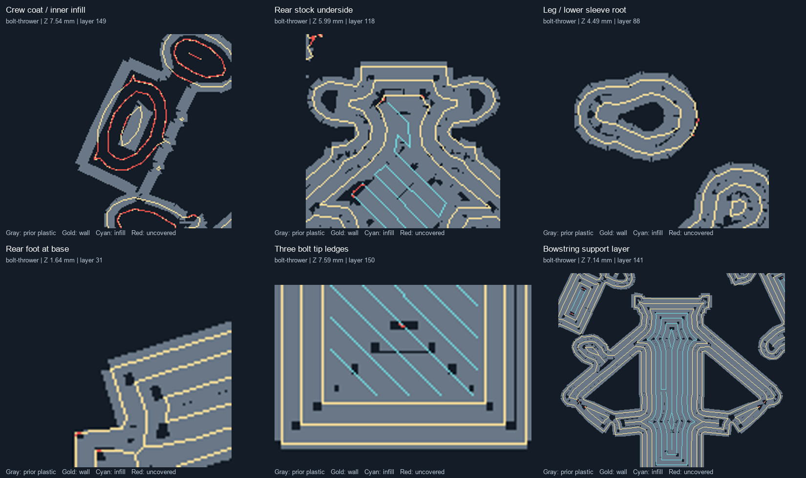

# Bolt thrower support-free design trial ? 2026-10-06

The bolt thrower now has permanent bracing under the stock, bow and strings; its crew hands grow from lower sleeve folds and the loader's spare bolt rests on the base. The revised assembly is a **trial intended to print without removable supports**. It is **not confirmed support-free or digitally validated**: the conservative deposited-layer screen still fails, and export topology diagnostics did not pass.

## Pinned changes

- `aurelian.expansion-bolt-thrower@3`: tapered central keel beneath the stock and three loaded bolt points, triangular bow/string braces with pointed openings, a rear stock buttress, and a grounded elevation screw. Original bow, loaded bolts, rack, crank and leg endpoints remain.
- `aurelian.expansion-crew-arms@4`: rounded palms and steep sleeve folds running from the existing ankle axes to the original grip landmarks.
- `aurelian.expansion-loader-bolt@2`: a 1.0 mm source shaft stands through the loader's unchanged right grip, approximately 16.6 degrees from vertical, with its butt inside the base.
- Local artillery coat, helmet, boot seats and leg parts provide hip-grown coat undersides, sloped face-window ceilings, level shoe contacts and fuller knee transitions. Shared head/nose and outer pointed helmet shapes remain unchanged.

All 58 previous army-expansion component hashes and the other 16 assembly recipes remain unchanged. Intermediate revisions are immutable. The current assembly and army overview use the new cached parts.

## Sliced evidence

Blender 5.1.2 exports apply 1.3 scale exactly once. PrusaSlicer 2.9.6 reopened each project and sliced without an external config. The named installed profiles were resolved and hashed read-only. All model extrusion uses tool 2 with the saved `0.4,0.25,0.4,0.4,0.4` nozzle array, 0.05 mm layers, 0.14 mm first layer, 205?C normal / 230?C first layer and 10 mm/s / 10 s cooling overrides. Main files have supports off.

| Diagnostic | Original, 15% gyroid | Revised, 15% gyroid | Selected trial, 100% rectilinear |
| --- | ---: | ---: | ---: |
| Conservative support/model filament | 32.4% | 14.4% | 13.7% |
| Unaccepted deposited runs | 272 | 226 | 202 |
| Centerline without prior plastic | 942.0 mm | 870.5 mm | 272.8 mm |
| Continuous nominal layers | Yes | Yes | Yes |
| Slicer estimate | 54m 29s | 1h 7m 25s | 1h 11m 6s |

The first two columns isolate the geometry change. The third also changes infill for this project; it is not a geometry-only comparison. Solid infill reduces unsupported internal path length but does not clear every crew contour. Support ratios use separate organic-support diagnostics at 45 degrees and are material-cost estimates, not failure probabilities.

The original long stock, rack and bowstring starts are backed by permanent stock. The horizontal spare bolt is replaced by the grounded pose. Remaining flags include closing/internal contours around the crew waist and arms, short brace/detail edges and facial details. Neither internal locations nor a small appearance are exemptions from the existing screen. No thresholds were relaxed.

Gray is previous-layer plastic; gold is current wall centerline; cyan is infill; red marks samples lacking prior-layer plastic. These panels retain residual failures as well as showing the corrected stock, bolt points and bowstring level.

A diagnostic global Exact export was also tested. It did not remove the residual contour flags and had worse topology diagnostics; it is not the selected trial. Manifold and Exact exports both failed diagnostic topology checks after exact STL indexing. No cleaned/repaired mesh was substituted. Full independent manufacturing validation, self-intersection checks, detailed dimensional probes and physical printing remain outstanding.

## Review and files

The local Three.js review was checked against the current assembly and inspected from front, side, rear and overhead. All 37 targeted tests passed, including saved Blender provenance, immutable definitions, grounded bracing, original bow geometry, grip alignment and shared-assembly isolation. These tests do not supersede failed printability checks.

The [print recipe](../specs/prusa-bolt-thrower.json) records the project-only solid-infill override. [Machine-readable evidence](evidence/bolt-thrower-support-trial-20261006.json) pins geometry, project, G-code and analysis hashes, comparisons and limitations.

Local artifacts are in `out/bolt-thrower-support-trial-20261006/`:

- `bolt-thrower-support-trial.3mf`: self-contained support-off trial, opened in PrusaSlicer 2.9.6.
- `bolt-thrower-support-trial.gcode`: 299 continuous layers; estimated 1h 11m and 1.08 g on tool 2.
- `stl/bolt-thrower.stl`: unchecked Blender Manifold export.
- `bolt-thrower/printability-review.json`, `previews/` and `support-audit/`: retained failed screens and separate conservative support previews.

The selected STL is reused byte-for-byte from the final geometry export; only the final infill comparison was resliced. Installed presets were not modified.
