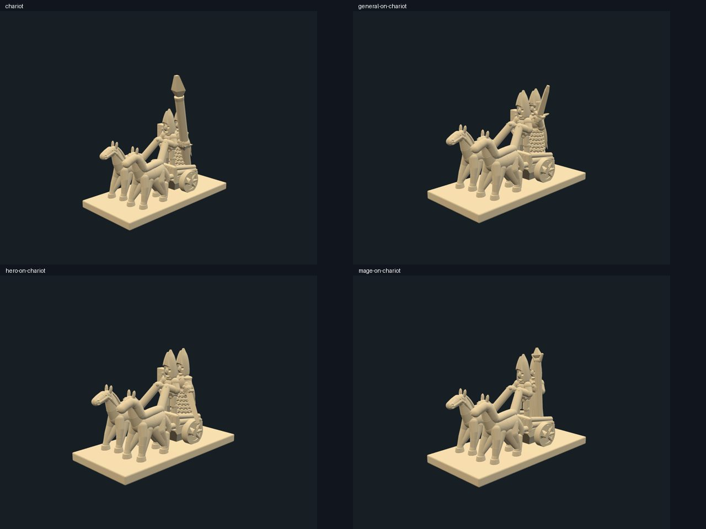
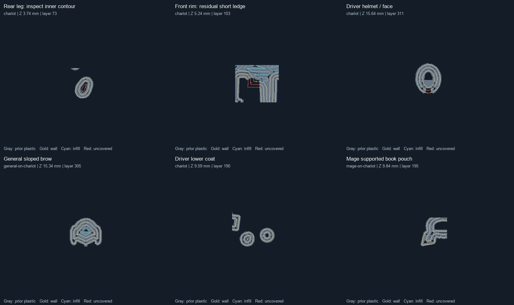

# Chariot overhang fixes ? 2026-10-06

The regular, General, Hero and Mage chariots now use local geometry revisions addressing the large defects in the [original sliced audit](chariots-sliced-overhang-review.md). Weapon tips slice continuously, the broad palm and robe-hem starts are removed, and the floor has a taper under its complete perimeter. **These are improved print trials, not digitally validated support-free builds.**

## Geometry changes

- The underbody reaches the front and rear deck edges. Solid wheel webs remain; wheel contact patches and the axle sit 0.20 mm lower in source space so the wheels begin inside the base.
- Chariot horses have steeper hind hocks, fuller inner chest/haunch transitions and tail continuations into the base. Hoof and hip endpoints are unchanged. Other cavalry still uses its existing horse.
- The driver's lower coat grows from the hips, and its shortened tails overlap that stock. Palms have rounded undersides; the spear palm grows from a tapered shaft-to-hand transition.
- The Mage's robe and folds reach into the deck. A tapered pouch backs the book underside while retaining its cover and clasp.
- Chariot sword and spear terminal sections are fuller and overlapping. The regular spear retains its uniform shaft and 18-degree lean.
- Chariot helmet face windows have sloping ceilings; the General additionally has a supported nape and sloped command brow. The outer crown, pointed top, shared heads, eye centers and equipment mounts stay pinned.

Only chariot assemblies use these revisions. All 34 previously published army-expansion part hashes, all 13 other expansion assemblies and every original chariot mount matrix remain unchanged. Intermediate revisions are retained as immutable history.

## Sliced comparison

The current installed profiles were resolved read-only and remained unchanged. Blender 5.1.2 exports apply 1.3 scale once. PrusaSlicer 2.9.6 projects use tool 2, 0.25 mm nozzle, 0.05 mm layers, 0.14 mm first layer, 205?C normal / 230?C first layer, 10 mm/s minimum speed and a 10 s slowdown threshold. Main projects have supports off. Each project was reopened and sliced without a separate configuration.

| Variant | Missing nominal layers, before ? after | Conservative support/model filament, before ? after |
| --- | ---: | ---: |
| Regular | 1 ? 0 | 24.6% ? 15.4% |
| General | 21 ? 0 | 31.7% ? 20.2% |
| Hero | 0 ? 0 | 29.6% ? 17.8% |
| Mage | 0 ? 0 | 31.1% ? 24.1% |

Support estimates come from separate organic-support slices at 45 degrees. They measure material cost under that conservative setting, not print-failure probability. Relative reductions range from 22.5% to 39.8%.

The selected spear-grip and rear-deck regions have no remaining unaccepted perimeter runs. The driver's former 4.5 mm lower-coat contour falls to a maximum 0.50 mm run in that region; the Mage's former 4.2 mm hem contour falls to 0.13 mm. The General's approximately 4.7 mm neck and 3.0 mm brow runs are gone. All individual and combined slices have continuous nominal layers.

The conservative deposited-layer screen **still fails on all four models**. Remaining flags include an internal leg-hole closure, small front-rim corners, mail and other attached details. The front-rim residual is approximately 1.5 mm of curved, anchored toolpath; that is not a 1.5 mm horizontal projection. General/Hero lower detail has runs up to approximately 1.7 mm. These remain trial observations rather than waived checks.

Gray is previous-layer plastic; gold is current wall centerline; cyan is infill; red marks samples without previous-layer plastic. The rear-leg red loop lies inside the surrounding supported outline. The General brow and Mage book panels show the formerly problematic levels after adding stock.

## Review and local test files

The local Three.js viewer was checked against current assembly placements, with front, side, rear and overhead views saved. Targeted and saved-provenance checks passed (32 tests), as did 11 historical regiment tests. This does not establish topology, self-intersection or physical-fit validation.

[Machine-readable evidence](evidence/chariot-overhang-fixes-20261006.json) pins source revisions, assembly/STL/project/G-code hashes, analysis hashes and before/after results. Full local artifacts are under `out/chariots-fixed-sliced-20261006-v4/`:

- `four-chariots-overhang-fixes.3mf`: current four-object trial, 50 mm center spacing, layer-by-layer on tool 2.
- `four-chariots-overhang-fixes.gcode`: combined plate reopened and sliced without an external config; estimated 8 h 18 min and 6.70 g.
- `<variant>/<variant>.3mf` and `.gcode`: individual support-free diagnostics.
- `<variant>/printability-review.json`, `previews/printability.json` and `support-audit/`: full conservative results and separate support previews.

The unchanged regular, Hero and Mage exports/slices were reused from the immediately preceding audit after STL and settings hash checks; only the final General brow revision required another export and individual slice. The combined plate was sliced fresh. Installed profile dumps and generated model artifacts stay outside source control.
