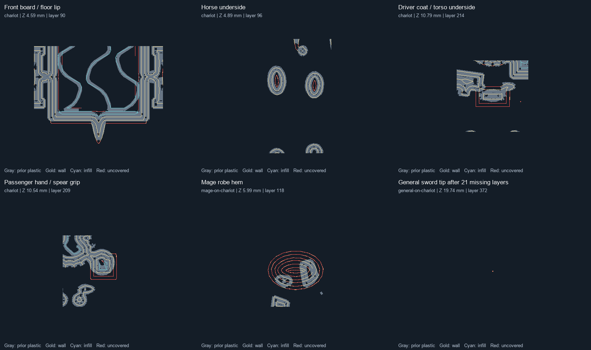

# Chariot sliced overhang review — 2026-10-06

This is the pre-fix audit; see the [subsequent geometry changes and sliced comparison](chariot-overhang-fixes.md).

All four chariots at the audited revisions retain overhang concerns. They are **not cleared for support-free printing**. This review changes no model geometry.

The current pinned regular, General, Hero and Mage assemblies were exported from cached parts with Blender 5.1.2 Manifold at 130% exactly once. Each saved PrusaSlicer 2.9.6 project was reopened and sliced without a separate configuration. The main projects use the user's installed Cool Detail presets, tool 2's 0.25 mm nozzle, 0.05 mm layers, 0.14 mm first layer, 205°C normal / 230°C first layer and 10 mm/s / 10 s cooling overrides. Supports are off. Installed presets were resolved read-only and their hashes remained unchanged.

Separate diagnostic projects enable organic supports everywhere at a conservative 45-degree threshold. These do not replace the support-free projects.

| Variant | Deposited layers | Exterior runs needing review | Automatic support/model filament |
| --- | ---: | ---: | ---: |
| Regular chariot | 515 | 307 | 24.6% |
| General | 372 | 351 | 31.7% |
| Hero | 371 | 328 | 29.6% |
| Mage | 395 | 373 | 31.1% |

A run is a segment of deposited toolpath, not a separate defect or a horizontal overhang distance. Counts include very small details. Support percentages exclude brim; they estimate material cost, not probability of print failure. The screen also flags internal infill and cannot model all same-layer anchoring, so those flags are not all exposed overhangs.

## Findings that merit geometry changes

- **Front floor lip/front board:** approximately 2.9 mm of unsupported exterior contour at printed Z 4.59 mm. The underbody ramp does not cover the whole projecting front lip. Extend a local taper to the board's leading edge.
- **Horse undersides:** exposed flags remain near the rear barrel/leg transitions, including approximately 1.8 mm runs at Z 4.89 mm. Inspect and blend those local undersides into the legs or traces.
- **Crew undersides:** the driver's coat/belt edge starts with an approximately 4.5 mm unsupported contour at Z 10.79 mm. The regular passenger's enlarged palm/grip has a similar flag at Z 10.54 mm. Both need tapered lower transitions.
- **Mage robe:** the hem begins with broad unsupported contours at Z 5.99 mm, including an approximately 4.2 mm exterior run. Extend the lower robe into the deck or support it with a continuous taper.
- **General sword tip:** PrusaSlicer explicitly warns of an empty layer between Z 18.64 and 19.74 mm. The last tip extrusion is isolated above 21 missing nominal layers. Thicken or reshape the terminal transition before printing.
- **Regular spear tip:** one nominal layer is omitted between Z 25.74 and 25.84 mm, followed by two tiny terminal layers. This is a sliced-detail issue in addition to the lower grip overhang.

Smaller flags remain around wheels, mail, helmets/faces and decoration. The wheel webs, shield braces and thicker reins do not establish whole-model printability; this audit does not individually certify those parts.

Gray is previous-layer plastic; gold is the current wall centerline; cyan is infill; red marks current centerline samples without previous-layer plastic. Panels show selected defects, not every flagged region. The sword-tip panel is deliberately mostly empty because there is no preceding layer of plastic.

## Reproducible local artifacts

[Machine-readable evidence](evidence/chariots-sliced-overhang-20261006.json) pins assembly, STL, project, G-code and analysis hashes. The full local artifacts are under `out/chariots-overhang-20261006/`:

- `four-chariots-no-supports.3mf`: four-object plate, 50 mm center spacing, layer-by-layer, tool 2.
- `<variant>/<variant>.3mf` and `.gcode`: individually reopened and sliced main projects.
- `<variant>/previews/printability.json`: all layers and flagged coordinates.
- `<variant>/support-audit/diagnostic-supports.3mf` and `.gcode`: conservative automatic-support previews.
- `sliced-detail-review.png`: actual path comparisons shown above.

Each diagnostic was assessed with `py -3.13 -m fdm_sculpt.regiment assess <variant-directory> --support-audit`. All four assessments return failure and retain their reports. The analysis now fits the full model footprint instead of the old infantry-strip raster. Diagnostic mode records skipped layers as failures; historical proof validation remains strict.

These remain **unchecked Blender exports and sliced design diagnostics**, not digitally validated or physically tested builds. Topology, self-intersections, independent repeat builds and physical trials remain outstanding.
